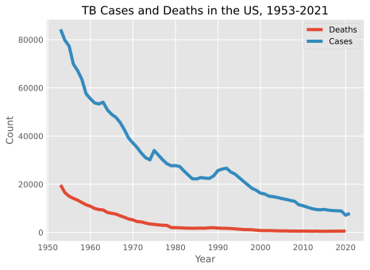
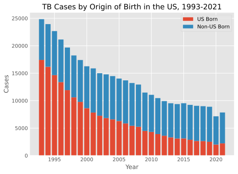

# Chest X-Ray Image Classification for Tuberculosis for Omdena Myanmar Chapter


## About the Project

This is some of the code that I contributed to the Omdena Myanmar Project as the Tuberculosis team lead for their project to democratize access to resources for the following respiratory lung disorders: tuberculosis, lung cancer, pneumonia, and COVID.  

Four teams worked alongside each other in building models for each disease for 8 weeks, and within each team, we selected the best model for deployment.  We had a team member who was experienced in Streamlit that developed a webapp for the model.


## Tuberculosis Around the Globe

Tuberculosis (TB) incidence rates can vary significantly by country, and the countries with the highest rates of TB infection can change over time due to various factors, including public health efforts, socioeconomic conditions, and the prevalence of risk factors such as HIV/AIDS. As of January 2022, some of the countries with high TB incidence rates included:

- **India** (due to high population density and challenges in healthcare infrastructure and access)
- **China** (due to large population)
- **Indonesia** (due to large population, challenges in healthcare access and infrastructure)
- **Pakistan** (prevalence of drug-resistant forms)
- **Nigeria** (challenges in healthcare infrastructure and access)
- **South Africa** (co-epidemic of TB and HIV/AIDS major challenge)
- **The Philippines**
- **Bangladesh**
- **Russia** (drug-resistant forms concern in some areas)
- **Ukraine** (drug-resistant forms)


## Tuberculosis Trends in the United States

### Since 1953, the United States has been trending towards eliminating TB, but has slowed unfortunately since the COVID pandemic.

<div class="row">
	<div class="column">
		
		
	</div>
</div>

### Since 1993, certain groups are at greater risk of TB than others, especially Asian Americans and Indigenous Peoples. TB has disproportionately affected some groups depending on various demographic, health, and social factors.

<center></center>

### Since 1993, people who were born in countries where TB disease is more common are at increasingly greater risk of exposure to TB.

<center></center>

### Medical conditions that weaken the immune system, such as, diabetes mellitus and human immunodeficiency virus (HIV), can increase a person’s risk of developing TB disease if they are infected.

### People living in congregate settings, including correctional facilities, detention centers, long-term care facilities, and homeless shelters, are at increased risk of becoming infected with TB due to shared airspaces.


## Risk Factors for Tuberculosis

Tuberculosis (TB) is a contagious disease caused by the bacterium Mycobacterium tuberculosis. Some of the factors that increase the risk of developing TB include:

1. **Weakened immune system:** People with weakened immune systems, such as those with HIV/AIDS, those undergoing chemotherapy or taking certain medications, and those with diabetes, are at higher risk of developing TB.
2. **Close contact with someone who has TB:** TB is spread through the air when an infected person coughs, sneezes, or talks. Being in close contact with someone who has TB increases the risk of getting infected.
3. **Living or working in crowded conditions:** TB spreads more easily in crowded places, such as prisons, homeless shelters, and nursing homes.
4. **Malnutrition:** People who are malnourished are more likely to develop TB because their immune systems are weakened.
5. **Age:** Elderly people and young children are more susceptible to TB because their immune systems are not fully developed or have weakened over time.

It is important to note that not everyone who is exposed to TB will develop the disease. However, if you think you may have been exposed to TB or have any symptoms such as coughing, fever, night sweats, and weight loss, it is important to seek medical attention.

## Data Sources

In deciding to build a binary classification model, we grouped healthy individuals with individuals infected with a disease other than Tuberculosis into a single category called non-Tuberculosis. 

We conducted a thorough search of various internet resources for Tuberculosis Chest X-Ray images, and we immediately noted the major class imbalance in the images for most datasets. Ultimately, we tried to collect as many Tuberculosis images from various datasets as possible and complemented the datasets with an equal amount of healthy and sick with non-TB CXR images. There were more images avaialble through TBPortals, but we would have to apply for access to the dataset, which includes the Belarus dataset, but that was freely available on Kaggle.

Ultimately, we compiled our Tuberculosis and non-Tuberculosis images from the following sources:

**Non-Tuberculosis:**

- 3800 CXR images from healthy individuals: 
  - [TBX11K Nankai University]()
- 3800 CXR images from infected non-TB individuals: 
  - [TBX11K Nankai University](https://drive.google.com/file/d/1r-oNYTPiPCOUzSjChjCIYTdkjBTugqxR/view)


**Tuberculosis:**

- 1048 CXR images from TB infected individuals: 
  - [Belarus (converted from DICOM)](https://www.kaggle.com/datasets/raddar/drug-resistant-tuberculosis-xrays)
- 394 CXR images from the original NLM Datasets: 
  - [NLM-Montgomery](https://data.lhncbc.nlm.nih.gov/public/Tuberculosis-Chest-X-ray-Datasets/Montgomery-County-CXR-Set/MontgomerySet/index.html)
  - [NLM-Shenzhen](https://data.lhncbc.nlm.nih.gov/public/Tuberculosis-Chest-X-ray-Datasets/Shenzhen-Hospital-CXR-Set/index.html)
- 800 CXR images from the TBX11K Dataset: 
  - [TBX11K Dataset](https://www.kaggle.com/datasets/usmanshams/tbx-11)
- 45 and 52 TB CXR images from DA and DB Datasets:
  - [TBXPredict DA](https://sourceforge.net/projects/tbxpredict/files/data/)
  - [TBXPredict DB (Converted from DICOM)](https://sourceforge.net/projects/tbxpredict/files/data/)


## Modeling

The team developed several transfer learning models, including AlexNet, ResNet50, VGG19, and EfficientNet. Two team members developed a CNN from scratch.  Here are the results from DenseNet:

<center></center>


## Folder Structure

	```
	├── README.md
	│
	├── _data
	│   ├── _augmented_sorted
	│	│   ├── _train  (contains the original CXR images including augmentations)
	│	│   ├── _val
	│	│   └── _test
	│	│
	│	├── _MTG_ClinicalReadings (contains the data for EDA)
	│	└── _SHZ_ClinicalReadings
	│	
	├── _images 
	├── _notebooks (contains the working notebooks for the project)
	├── _references (contains the academic papers cited)
	└── Final_Notebook.ipynb
	```


## References

Jaeger, S., Candemir, S., Antani, S., Wáng, Y. X., Lu, P. X., & Thoma, G. (2014). Two public chest X-ray datasets for computer-aided screening of pulmonary diseases. Quantitative imaging in medicine and surgery, 4(6), 475–477. [https://doi.org/10.3978/j.issn.2223-4292.2014.11.20](https://doi.org/10.3978/j.issn.2223-4292.2014.11.20)

Chauhan, A., Chauhan, D., & Rout, C. (2014). Role of Gist and PHOG features in computer-aided diagnosis of tuberculosis without segmentation. PloS one, 9(11), e112980. [https://doi.org/10.1371/journal.pone.0112980](https://doi.org/10.1371/journal.pone.0112980)

Liu, Y., Wu, Y. H., Ban, Y., Wang, H., & Cheng, M. M. (2020). Rethinking Computer-Aided Tuberculosis Diagnosis. 2020 IEEE/CVF Conference on Computer Vision and Pattern Recognition (CVPR), 2643-2652. [https://doi.org/10.1109/CVPR42600.2020.00272](https://doi.org/10.1109/CVPR42600.2020.00272)

Rahman, T., Khandakar, A., Kadir, M.A., Islam, K.R., Islam, K.F., Mazhar, R., Hamid, T., Islam, M.T., Mahbub, Z.B., Ayari, M.A., & Chowdhury, M.E. (2020). Reliable Tuberculosis Detection Using Chest X-Ray With Deep Learning, Segmentation and Visualization. IEEE Access, 8, 191586-191601. [https://doi.org/10.48550/arXiv.2007.14895](https://doi.org/10.48550/arXiv.2007.14895)


## Contact Information:

###  **Email:** [stevenyan@uchicago.edu](mailto:steven.yan@uchicago.edu)

###  **LinkedIn:** [https://www.linkedin.com/in/datascisteven](https://www.linkedin.com/in/datascisteven)

###  **Github:** [https://www.github.com/datascisteven](https://www.github.com/datascisteven)


