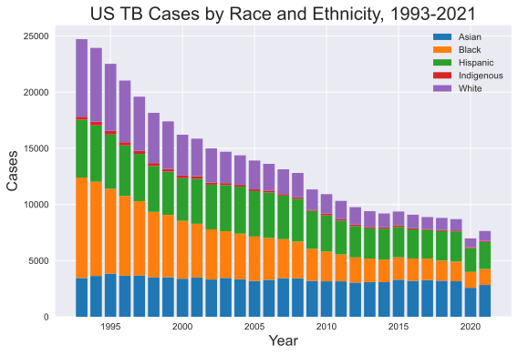

# Chest X-Ray Image Classification for Tuberculosis for Omdena Myanmar Chapter


## About the Project

This is some of the code that I contributed to the Omdena Myanmar Project as the Tuberculosis team lead for their project to democratize access to resources for the following respiratory lung disorders: tuberculosis, lung cancer, pneumonia, and COVID.  

Four teams worked alongside each other in building models for each disease for 8 weeks, and within each team, we selected the best model for deployment.  We had a team member who was experienced in Streamlit that developed a webapp for the model.

Original Repo: https://github.com/OmdenaAI/myanmar-chapter-chest-x-rays

Streamlit App: https://chest-xrays-detection-system.streamlit.app/


## Tuberculosis Trends in the United States

#### Since 1953, the United States has been trending towards eliminating TB, but has slowed unfortunately since the COVID pandemic.

In 1953, there were **84304** reported cases and an incidence rate of **52.6** cases per 100000 persons.  In 2022, there were **8300** reported TB cases, which is an incidence rate of **2.5** cases per 100000 persons, and an estimated **13 million** with latent TB infection, compared to a reported **7874** cases in 2021.  

In 1953, the mortality rate was 12.4 cases per 100000 cases. Since 2003, the US has achieved a mortality rate of around 0.2 per 100000 persons and has consistently hovered in that range with the lowest mortality rate achieved in 2015 (0.1 per 100000 persons).

<div class="row">
	<div class="column">
		<center>
		</center>
	</div>
</div>

Note that the two graphs closely match the other.  As cases go down, the incidence rate go down.  As deaths go downk the mortality rate correspondingly go down in a similar pattern.

### TB has historically affected groups that have experienced greater obstacles to and lower access to resources for healthcare. 

The percentage of TB cases amongst the racial and ethnic groups (Black, Hispanic, and Asian persons) are higher compared to what is expected based on the percentage of the US population. Here is the data from 2021 about racial percentage:

- Hispanic percentage: 19.1%
- Asian percentage: 6.3%
- Black percentage: 13.6%
- White not Hispanic percentage: 58.9% 

In 2021, 88% of the TB cases reported occured among the racial and ethnic minority groups.

<div class="row">
	<div class="column">
		<center>
		</center>
	</div>
</div>

Note the difference in cases vs. incidence rate of the different races and ethnicities.  Incidence rate is an indication of the risk of contracting the disease, so a greater incidence rate means a greater risk of becoming infected.

For White persons in the United States, they have not only have a proportionally lower amount of cases (884 or 11.2%) in terms of the racial percentages, but also a much lower incidence rate (0.4 per 100000 persons) compared to the other racial and ethnic groups.

For Asian Americans in the United States, they experience the greatest health disparity. Representing 6% of the population, they constituted 36% (2834) of the TB cases reported and had an incidence rate of 14.4 cases per 100000 persons. The incidence rate for Asian persons is **36x higher** than for White persons.

### Since 1993, people who were born in countries where TB disease is more common are at increasingly greater risk of exposure to TB.

<div class="row">
	<div class="column">
		<center>
		</center>
	</div>
</div>

This is the most prominent risk factor for TB disease in the United States.  On 2021, 71% of the TB cases were attributed to non-US born individuals, and 28 to US-born individuals.  THe incidence rate for non-US born persons (12.5 per 100000) is 16 times higher than for US born persons (0.8 per 100000)

### The remaining factors contributing to health disparity in the rate of TB  in the US include: co-existing medical conditions, geographical area, housing insecurity, and incarceration. 


## Risk Factors for Tuberculosis

Tuberculosis (TB) is a contagious disease caused by the bacterium Mycobacterium tuberculosis. Some of the factors that increase the risk of developing TB include:

1. **Weakened immune system:** People with weakened immune systems, such as those with HIV/AIDS, those undergoing chemotherapy or taking certain medications, and those with diabetes, are at higher risk of developing TB.
2. **Close contact with someone who has TB:** TB is spread through the air when an infected person coughs, sneezes, or talks. Being in close contact with someone who has TB increases the risk of getting infected.
3. **Living or working in crowded conditions:** TB spreads more easily in crowded places, such as prisons, homeless shelters, and nursing homes.
4. **Malnutrition:** People who are malnourished are more likely to develop TB because their immune systems are weakened.
5. **Age:** Elderly people and young children are more susceptible to TB because their immune systems are not fully developed or have weakened over time.

It is important to note that not everyone who is exposed to TB will develop the disease. 

If you fall into one of the above factors, think you may have been exposed to TB or have any symptoms such as coughing, fever, night sweats, and weight loss, it is important to seek medical attention.

## Who Should Get Tested in the United States

According to the CDC, certain groups who are at higher risk for being infected with TB bacteria should get tested including:

- if you have spent time with someone who has TB disease
- if you come from a country where TB disease is common (see countries above)
- if you who live or work in high-risk settings (correctional facilities, nursing homes, homeless shelters)
- if you are a frontline worker that cares for patients at increased risk for TB disease
- if you have been exposed to adults who are at increased risk for latent tuberculosis infection or TB disease

Most who become infected with the TB bacteria never develop any symptoms known as latent TB infection.  Certain groups who have latent TB infections are more likely to develop TB disease, including:

- People with HIV infection or another disease that weaken the immune system
- People who became infected with TB bacteria in the last 2 years
- Babies and young children and elderly people
- People who inject illegal drugs
- People who were not treated correctly for TB in the past

TB tests are generally not needed for people with a low risk of infection with TB bacteria.

## Tuberculosis Around the Globe

Tuberculosis (TB) incidence rates can vary significantly by country, and the countries with the highest rates of TB infection can change over time due to various factors, including public health efforts, socioeconomic conditions, and the prevalence of risk factors such as HIV/AIDS. As of January 2022, some of the countries with high TB incidence rates included:

- **India** (due to high population density and challenges in healthcare infrastructure and access)
- **China** (due to large population)
- **Indonesia** (due to large population, challenges in healthcare access and infrastructure)
- **Pakistan** (prevalence of drug-resistant forms)
- **Nigeria** (challenges in healthcare infrastructure and access)
- **South Africa** (co-epidemic of TB and HIV/AIDS major challenge)
- **The Philippines**
- **Bangladesh**
- **Russia** (drug-resistant forms concern in some areas)
- **Ukraine** (drug-resistant forms)

Worldwide, 1.3 million people died from TB, which makes TB the second leading infectious killer after COVID-19 and before HIV and AIDS. 

About a quarter of the world population or **1.97 billion** is estimated to have been infected with TB.  5%-10% of those infected will develop the disease. An estimated **10.6 million** people fell ill with TB in 2022:  **2.46 million** from the African region, **4.82 million** in Southeast Asia, and **1.89 million** from the Western Pacific region.

Let's compare the incidence rate between the wealthy industrialized nations and the industrializing nations.  In 2021, the incidence rate for the African region was **212/100K**, Southeast Asia region **234/100K**, Mediterranean region **112 per 100000**, and Western Pacific region **98/100K**.  However, the incidence rate for the Americas was **30/100K** and for the European region **25/100K**.

<center></center>

It is important to note that those who are infected but has not developed the disease are not infectious, and the disease can be treated with antibiotics. 

### Tuberculosis is **ENTIRELY preventable and curable**.


## Business Understanding

Coming from the United States where tuberculosis affects certain at-risk groups or populations, the need to develop more TB resources is not immediately apparent. In light of the stagggering numbers around the world who are affected by tuberculosis, the need for developing an app to democratize resources for the detection of lung disease is never greater.  

Given the greater almost ubiquitous access to mobile phones and greater prevalence of mobile phones with at least uploading capabilities around the globe, developing a web app freely accessible seems to be a logical medium for disseminating such an important resource, as well as important information for prevention, testing, treatment, etc.  

The work through this Omdena project sponsored by the Myanmar chapter will help to alleviate and lessen the health disparity as evidenced by the world vs. the US statistics. You can appreciate te scope of the project and the potential for worldwide impact in developing an open-source detection app for various lung diseases. I have only looked at tuberculosis, but the project included detection capabilities for COVID-19, lung cancer, and pneumonia.


## Data Sources

In deciding to build a binary classification model, we grouped healthy individuals with individuals infected with a disease other than Tuberculosis into a single category called non-Tuberculosis. 

We conducted a thorough search of various internet resources for Tuberculosis Chest X-Ray images, and we immediately noted the major class imbalance in the images for most datasets. Ultimately, we tried to collect as many Tuberculosis images from various datasets as possible and complemented the datasets with an equal amount of healthy and sick with non-TB CXR images. There were more images avaialble through TBPortals, but we would have to apply for access to the dataset, which includes the Belarus dataset, but that was freely available on Kaggle.

Ultimately, we compiled our Tuberculosis and non-Tuberculosis images from the following sources:

**Non-Tuberculosis:**

- 3800 CXR images from healthy individuals: 
  - [TBX11K Nankai University]()
- 3800 CXR images from infected non-TB individuals: 
  - [TBX11K Nankai University](https://drive.google.com/file/d/1r-oNYTPiPCOUzSjChjCIYTdkjBTugqxR/view)


**Tuberculosis:**

- 1048 CXR images from TB infected individuals: 
  - [Belarus (converted from DICOM)](https://www.kaggle.com/datasets/raddar/drug-resistant-tuberculosis-xrays)
- 394 CXR images from the original NLM Datasets: 
  - [NLM-Montgomery](https://data.lhncbc.nlm.nih.gov/public/Tuberculosis-Chest-X-ray-Datasets/Montgomery-County-CXR-Set/MontgomerySet/index.html)
  - [NLM-Shenzhen](https://data.lhncbc.nlm.nih.gov/public/Tuberculosis-Chest-X-ray-Datasets/Shenzhen-Hospital-CXR-Set/index.html)
- 800 CXR images from the TBX11K Dataset: 
  - [TBX11K Dataset](https://www.kaggle.com/datasets/usmanshams/tbx-11)
- 45 and 52 TB CXR images from DA and DB Datasets:
  - [TBXPredict DA](https://sourceforge.net/projects/tbxpredict/files/data/)
  - [TBXPredict DB (Converted from DICOM)](https://sourceforge.net/projects/tbxpredict/files/data/)


## Modeling

The team developed several transfer learning models, including AlexNet, ResNet50, VGG19, and EfficientNet, and some CNN's from scratch. I will only present results from the DenseNet modeling. The first graph is the confusion matrix:

<center></center>

This second graph demonstrates the metrics measured during modeling, including loss, accuracy, precision, recall, PR-AUC, and ROC_AUC.  Here is a discussion of some fo the considerations in selecting additional metrics for reporting during the modeling process: 

- **Accuracy (TP + TN / P + N)**: 
	- widely used to measure overall correctness of model since it represents the ratio of correctly classified instances to total number of instances in dataset
	- misleading with imbalanced datasets which is characteristic of disease classification models since high accuracy can result from simply predicting the positive class
- **Precision (TP / TP + FP)**:  	
	- measures accuracy of positive predictions made of model
	- valauble when you want to ensure the model's positive predictions are reliable and not dominated by false positives and in a scenario where false positives are costly or undesirable
	- high precision means that when the model predicts a positive case it is not a false alarm
- **Recall or Sensitivity (TP / TP + FN)**:
	- measures ability to correctly capture positive instances 
	- crucial in medical diagnostics as it reflects ability to correctly identify individuals with the disease and failing to diagnose a disease can have signficant consequences
	- high recall means that model is effective at identifying most of the cases, minimizing false negatives since they are positive instances incorrectly classified

The PR-AUC (Precision-Recall Area Under the Curve) and AUC-ROC (Area Under the Receiver Operating Characteric Curve) metrics are secondary and can be evaluated in conjunction with the other metrics.

- **Specificity (TN / TN + FP)**:
	- measures ability to correctly classify negative instances as negative since FP are negative instances incorrectly classified
	- valuable in ensuring that model performs well in identifying negative cases as negative and minimizing false positives
	- correlate to recall or specificity
- **AUC-ROC (Sensitivity (TPR) vs. 1-Specificity (FPR))**:
	- measures ability to discriminate between TB and non-TB cases since sensitivity measures ability to classify positive instances as positive and specificity measures ability to classify negative instances as negative
	- higher score suggests better ability to distinguish between the two classes
- **PR-AUC (Precision vs. Recall)**:
	- useful for visualizing tradeoff between precision and recall and for imbalanced datasets such as those for medical diagnostics
	- measures ability to make positive predictions while maintaining high precision (minimizing false postiives)
	- crucial in a scenario where giving a false positive diagnosis would be deterimental or stressful for the patient


<center></center>


**At the end of the training, the validation metrics were the following:**

- Validation Loss: 0.18830911815166473
- Validation Accuracy: 0.9482421875
- Validation Precision: 0.9843391180038452
- Validation Recall: 0.9487156867980957
- Validation ROC-AUC: 0.8390804529190063
- Validation PR-AUC: 0.9521738886833191


## Folder Structure

	```
	├── README.md
	│
	├── _data
	│   ├── _augmented_sorted
	│	│   ├── _train  (contains the original CXR images including augmentations)
	│	│   ├── _val
	│	│   └── _test
	│	│
	│	├── _MTG_ClinicalReadings (contains the data for EDA)
	│	└── _SHZ_ClinicalReadings
	│	
	├── _images 
	├── _notebooks (contains the working notebooks for the project)
	├── _references (contains the academic papers cited)
	└── Final_Notebook.ipynb
	```


## References

Jaeger, S., Candemir, S., Antani, S., Wáng, Y. X., Lu, P. X., & Thoma, G. (2014). Two public chest X-ray datasets for computer-aided screening of pulmonary diseases. Quantitative imaging in medicine and surgery, 4(6), 475–477. [https://doi.org/10.3978/j.issn.2223-4292.2014.11.20](https://doi.org/10.3978/j.issn.2223-4292.2014.11.20)

Chauhan, A., Chauhan, D., & Rout, C. (2014). Role of Gist and PHOG features in computer-aided diagnosis of tuberculosis without segmentation. PloS one, 9(11), e112980. [https://doi.org/10.1371/journal.pone.0112980](https://doi.org/10.1371/journal.pone.0112980)

Liu, Y., Wu, Y. H., Ban, Y., Wang, H., & Cheng, M. M. (2020). Rethinking Computer-Aided Tuberculosis Diagnosis. 2020 IEEE/CVF Conference on Computer Vision and Pattern Recognition (CVPR), 2643-2652. [https://doi.org/10.1109/CVPR42600.2020.00272](https://doi.org/10.1109/CVPR42600.2020.00272)

Rahman, T., Khandakar, A., Kadir, M.A., Islam, K.R., Islam, K.F., Mazhar, R., Hamid, T., Islam, M.T., Mahbub, Z.B., Ayari, M.A., & Chowdhury, M.E. (2020). Reliable Tuberculosis Detection Using Chest X-Ray With Deep Learning, Segmentation and Visualization. IEEE Access, 8, 191586-191601. [https://doi.org/10.48550/arXiv.2007.14895](https://doi.org/10.48550/arXiv.2007.14895)


## Contact Information:

###  **Email:** [stevenyan@uchicago.edu](mailto:steven.yan@uchicago.edu)

###  **LinkedIn:** [https://www.linkedin.com/in/datascisteven](https://www.linkedin.com/in/datascisteven)

###  **Github:** [https://www.github.com/datascisteven](https://www.github.com/datascisteven)